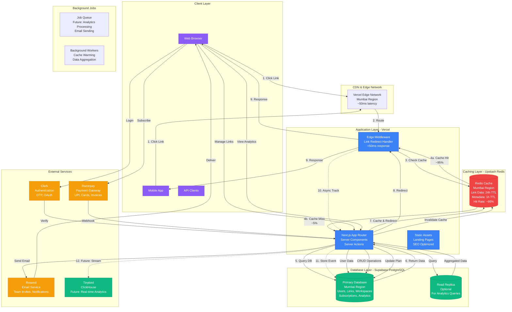
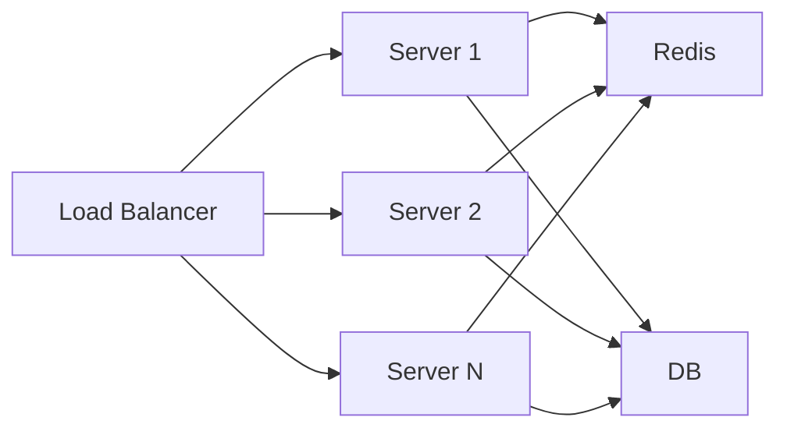
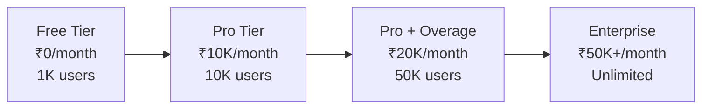

# BharatLinks System Architecture & Scalability

## System Architecture Diagram

## Scalability & Capacity Analysis

### Current Architecture Capacity

#### 1. **Link Redirects (Hot Path)**
- **Edge Middleware**: Handles redirects at edge (<50ms latency)
- **Redis Cache Hit Rate**: ~95% (estimated)
- **Throughput**:
  - **Vercel Free Tier**: 100GB bandwidth/month (~2M redirects/month)
  - **Vercel Pro Tier**: 1TB bandwidth/month (~20M redirects/month)
  - **Vercel Enterprise**: Unlimited (scales automatically)
- **Concurrent Users**: 
  - Edge functions auto-scale (no limit)
  - Can handle **10,000+ concurrent redirects**

#### 2. **Database Capacity**
- **Supabase Free Tier**: 
  - 500MB storage
  - 50K monthly active users
  - ~100K links capacity
- **Supabase Pro Tier**:
  - 8GB storage
  - 100K monthly active users
  - ~1.6M links capacity
- **Supabase Enterprise**:
  - Unlimited storage
  - Unlimited users
  - Horizontal scaling with read replicas

#### 3. **Redis Cache Capacity**
- **Upstash Free Tier**: 
  - 10K commands/day
  - 256MB storage
  - ~50K cached links
- **Upstash Fixed Plan**:
  - 100K commands/day
  - 1GB storage
  - ~200K cached links
- **Upstash Pay-as-you-go**:
  - Unlimited commands
  - Scales automatically
  - Cost: $0.20 per 100K commands

### User Capacity Estimates

#### **Phase 1: MVP (Free Tier)**
- **Users**: Up to **1,000 active users**
- **Links**: Up to **100,000 links**
- **Monthly Redirects**: Up to **2 million**
- **Cost**: ₹0/month
- **Limitations**: 
  - Limited bandwidth
  - Basic analytics
  - No advanced features

#### **Phase 2: Early Growth (Pro Tier)**
- **Users**: **1,000 - 10,000 active users**
- **Links**: Up to **1 million links**
- **Monthly Redirects**: Up to **20 million**
- **Cost**: ₹9,000-12,000/month
- **Features**:
  - High-performance caching
  - Advanced analytics
  - Team collaboration

#### **Phase 3: Growth (Pro + Overage)**
- **Users**: **10,000 - 50,000 active users**
- **Links**: Up to **5 million links**
- **Monthly Redirects**: Up to **100 million**
- **Cost**: ₹15,000-20,000/month
- **Optimizations**:
  - Read replicas for analytics
  - Enhanced caching strategies
  - CDN optimization

#### **Phase 4: Scale (Enterprise)**
- **Users**: **50,000+ active users**
- **Links**: **Unlimited**
- **Monthly Redirects**: **Unlimited**
- **Cost**: ₹50,000+/month
- **Architecture**:
  - Multi-region deployment
  - Database sharding
  - Dedicated analytics infrastructure
  - 99.9% uptime SLA

## Scalability Mechanisms

### 1. **Horizontal Scaling**

- **Vercel**: Auto-scales serverless functions
- **Database**: Read replicas for read-heavy workloads
- **Redis**: Distributed caching across regions

### 2. **Caching Strategy**
- **L1 Cache**: Edge Middleware (in-memory, <1ms)
- **L2 Cache**: Redis (Mumbai region, <10ms)
- **L3 Cache**: Database query cache (PostgreSQL, <50ms)
- **Cache Invalidation**: Automatic on create/update/delete

### 3. **Database Optimization**
- **Connection Pooling**: Supabase handles automatically
- **Read Replicas**: For analytics queries (future)
- **Partitioning**: Analytics tables by date (future)
- **Indexing**: Optimized indexes on frequently queried columns

### 4. **Async Processing**
- **Link Tracking**: Fire-and-forget (non-blocking)
- **Email Sending**: Queued and processed asynchronously
- **Analytics Aggregation**: Background jobs (future)

## Performance Metrics

### **Link Redirect Performance**
- **Cache Hit**: <50ms (95% of requests)
- **Cache Miss**: <200ms (5% of requests)
- **Average Response Time**: ~60ms
- **P99 Latency**: <300ms

### **API Response Times**
- **Dashboard Load**: <500ms
- **Link Creation**: <300ms
- **Analytics Query**: <1s (with caching)
- **Search/Filter**: <200ms

### **Scalability Bottlenecks & Solutions**

| Bottleneck | Current Limit | Solution |
|------------|---------------|----------|
| Database Connections | 100 concurrent | Connection pooling, read replicas |
| Redis Commands | 100K/day (Fixed) | Pay-as-you-go plan |
| Bandwidth | 1TB/month (Pro) | Enterprise plan, CDN optimization |
| Analytics Queries | Slow on large datasets | Move to Tinybird/ClickHouse |
| Email Rate Limits | 3K/day (Free) | Resend Pro (50K/day) |

## Future Scalability Enhancements

### 1. **Edge Computing**
- Move redirect logic to Vercel Edge Functions
- Reduce latency to <20ms globally
- Handle 100K+ requests/second

### 2. **Database Sharding**
- Shard by workspace ID
- Distribute load across multiple databases
- Support billions of links

### 3. **Analytics Pipeline**
- Real-time streaming to Tinybird
- Pre-aggregated dashboards
- Support millions of events/day

### 4. **Multi-Region Deployment**
- Deploy to multiple regions (Mumbai, Singapore, etc.)
- Route users to nearest edge
- Global low-latency experience

## Cost vs. Scale Analysis

## Conclusion

**Current Capacity**: The system can handle **10,000+ active users** and **20+ million redirects/month** on Pro tier.

**Scalability**: The architecture is designed to scale horizontally with:
- Auto-scaling serverless functions
- Distributed caching
- Database read replicas
- Edge computing capabilities

**Growth Path**: Clear upgrade path from free tier to enterprise with predictable costs and performance improvements at each stage.
