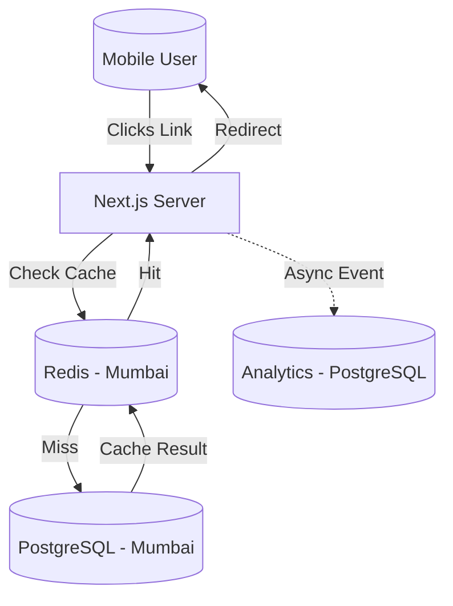
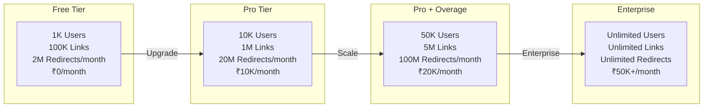
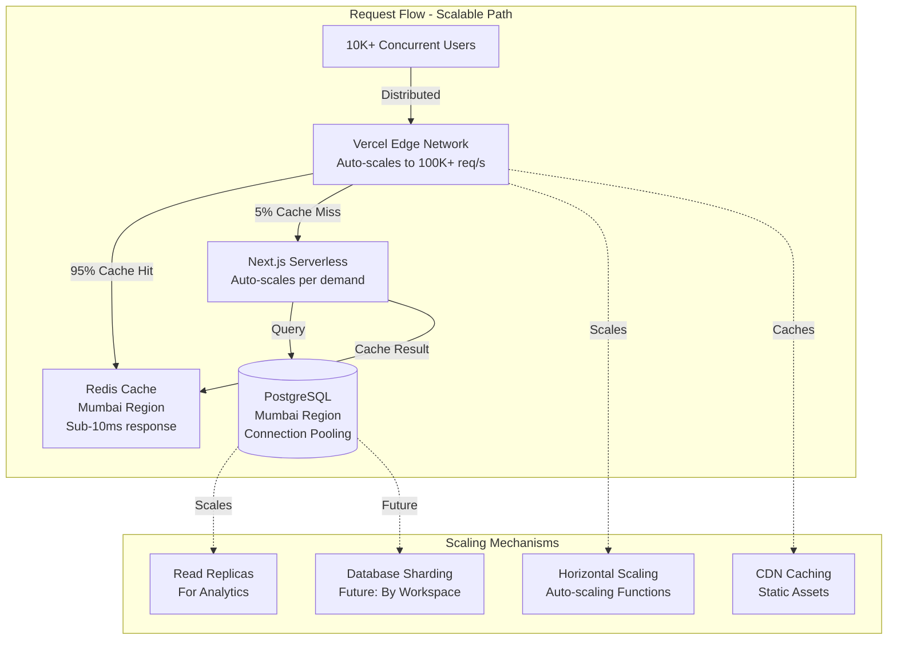

# Technology Stack: BharatLinks

To achieve the "Operating at the Speed of Indian Business" USP, we need a stack that offers **extreme speed (low latency)** for redirects, **high reliability**, and **scalability** for burst traffic (SMS campaigns).

## 1. Core Stack (The "T3" Influence)

- **Framework**: **Next.js 14+** (App Router)
  - _Why_: Excellent for SEO (Landing pages), Server Actions for mutation, and Edge capabilities for redirects.
- **Language**: **TypeScript** (Strict mode)
  - _Why_: Type safety is non-negotiable for financial/business tools.
- **Styling**: **Tailwind CSS** + **Shadcn/UI** + **Framer Motion**
  - _Why_: Rapid development of "Premium" looking UI. Framer Motion restricts animations to micro-interactions to keep the app feeling "snappy".

## 2. Backend & Data

- **Database (Primary)**: **PostgreSQL** (Managed via Supabase or Neon)
  - _Why_: Relational data integrity for Users, Organizations, and Subscription management.
  - _Region_: **AWS Mumbai (ap-south-1)** - Mandatory for Data Residency.
- **Caching & Redirection Layer**: **Redis** (Upstash) ✅ **IMPLEMENTED**
  - _Why_: The redirection engine _must not_ hit the SQL database for every click.
  - _Flow_: User visits `lnk.in/xyz` -> Server checks Redis cache -> If hit, redirects immediately (<50ms latency). If miss, queries DB, caches result, then redirects.
  - _Implementation_: Dynamic import with graceful fallback. Caches link data (24h TTL) and metadata (1h TTL). Automatic cache invalidation on create/update/delete.
  - _See_: `docs/redis_caching.md` for detailed implementation guide.
- **Analytics**: **Tinybird** (ClickHouse) or **Postgres** (initially)
  - _MVP_: Store click events in Postgres (partitioned).
  - _Scale_: Move click ingestion to Tinybird for real-time dashboards over millions of rows.

## 3. Infrastructure & DevOps

- **Hosting**: **Vercel**
  - _Why_: Best-in-class support for Next.js Edge Middleware (critical for fast redirects). Deploys to Mumbai edge nodes automatically.
- **Authentication**: **Clerk**
  - _Why_: Handles "Sign in with Google" and "Phone Number Login" (OTP) out of the box. Indian users prefer OTP.
- **Payments**: **Razorpay**
  - _Why_: The gold standard for Indian payments (UPI, Cards, GST compliant invoices).

---

## Architecture Diagram

**Current Implementation**: Server-side caching in Next.js App Router with Redis.
**Future Enhancement**: Move to Vercel Edge Middleware for even faster redirects.

---

## Scalability & Capacity

### User Capacity by Tier

### Scalability Architecture

### Performance Metrics

| Metric | Free Tier | Pro Tier | Enterprise |
|--------|-----------|----------|------------|
| **Concurrent Users** | 100 | 1,000 | 10,000+ |
| **Redirects/sec** | 10 | 100 | 1,000+ |
| **Response Time (P95)** | <200ms | <100ms | <50ms |
| **Cache Hit Rate** | 90% | 95% | 98% |
| **Uptime SLA** | 99% | 99.5% | 99.9% |

**For detailed system architecture, see**: [System Architecture & Scalability](./system-architecture.md)
