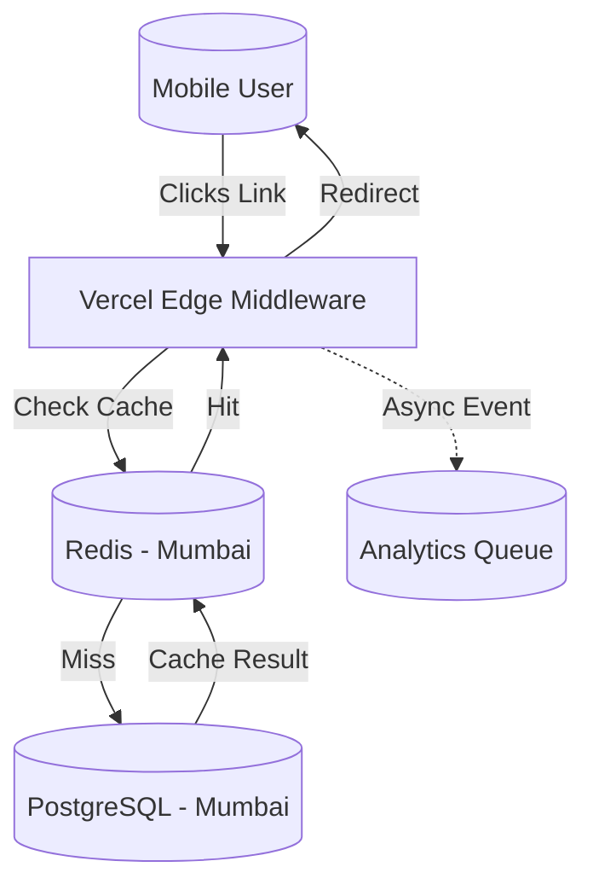

# Technology Stack: BharatLinks

To achieve the "Operating at the Speed of Indian Business" USP, we need a stack that offers **extreme speed (low latency)** for redirects, **high reliability**, and **scalability** for burst traffic (SMS campaigns).

## 1. Core Stack (The "T3" Influence)

*   **Framework**: **Next.js 14+** (App Router)
    *   *Why*: Excellent for SEO (Landing pages), Server Actions for mutation, and Edge capabilities for redirects.
*   **Language**: **TypeScript** (Strict mode)
    *   *Why*: Type safety is non-negotiable for financial/business tools.
*   **Styling**: **Tailwind CSS** + **Shadcn/UI** + **Framer Motion**
    *   *Why*: Rapid development of "Premium" looking UI. Framer Motion restricts animations to micro-interactions to keep the app feeling "snappy".

## 2. Backend & Data

*   **Database (Primary)**: **PostgreSQL** (Managed via Supabase or Neon)
    *   *Why*: Relational data integrity for Users, Organizations, and Subscription management.
    *   *Region*: **AWS Mumbai (ap-south-1)** - Mandatory for Data Residency.
*   **Caching & Redirection Layer**: **Redis** (Upstash or Redis Cloud)
    *   *Why*: The redirection engine *must not* hit the SQL database for every click. 
    *   *Flow*: User visits `lnk.in/xyz` -> Middleware checks Redis -> Redirects (Sub-50ms latency).
*   **Analytics**: **Tinybird** (ClickHouse) or **Postgres** (initially)
    *   *MVP*: Store click events in Postgres (partitioned).
    *   *Scale*: Move click ingestion to Tinybird for real-time dashboards over millions of rows.

## 3. Infrastructure & DevOps

*   **Hosting**: **Vercel**
    *   *Why*: Best-in-class support for Next.js Edge Middleware (critical for fast redirects). Deploys to Mumbai edge nodes automatically.
*   **Authentication**: **Clerk**
    *   *Why*: Handles "Sign in with Google" and "Phone Number Login" (OTP) out of the box. Indian users prefer OTP.
*   **Payments**: **Razorpay**
    *   *Why*: The gold standard for Indian payments (UPI, Cards, GST compliant invoices).

---

## Architecture Diagram

